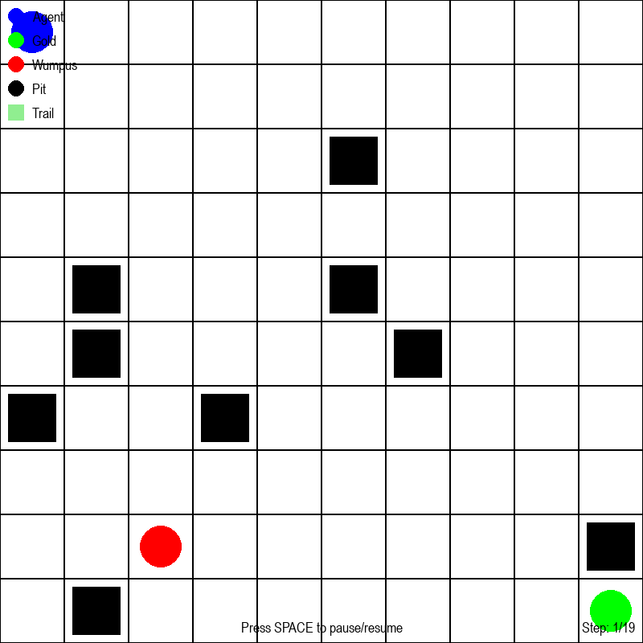
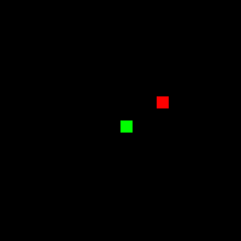

# 🕹️ Classic AI Game Collection: Wumpus World & Snake

A collection of classic AI-powered games implemented in Python: **Wumpus World** and **Snake**. These projects showcase fundamental artificial intelligence concepts, pathfinding, and game logic, making them perfect for learning and experimentation.


## 🌟 Features

- **🧠 Intelligent Agents**: AI-driven gameplay for both Wumpus World and Snake
- **🎮 Interactive Gameplay**: Playable via terminal or graphical interface (if available)
- **🔍 Pathfinding & Decision Making**: Demonstrates search algorithms and agent reasoning
- **📚 Educational**: Well-commented code for learning AI and game development
- **🛠️ Modular Design**: Easy to extend or modify for new features

## 🏗️ Architecture

```
ai-games/
├── wumpusfinal.py        # Wumpus World game with AI agent
├── snakefinal.py         # Snake game with AI agent
├── snake_replay.gif      # Snake game AI demo (GIF)
├── wumpus_path.gif       # Wumpus World AI demo (GIF)
├── requirements.txt      # Python dependencies
└── README.md             # This file
```

## 🎲 Game Previews

### 🏹 Wumpus World

A grid-based logic game where an AI agent explores a cave, avoids pits, and hunts the Wumpus using percepts and reasoning.

<p align="center">
  
</p>

- **AI Features**: Knowledge-based agent, logical inference, safe pathfinding
- **Objective**: Find the gold and escape without falling into pits or being eaten by the Wumpus

### 🐍 Snake

The classic Snake game, enhanced with an AI agent that navigates the grid, collects food, and avoids collisions.

<p align="center">
  
</p>

- **AI Features**: Pathfinding (e.g., BFS/DFS/A*), survival strategies
- **Objective**: Achieve the highest score by eating food and growing the snake

## 🚀 Quick Start

### Prerequisites

- Python 3.8 or higher
- pip package manager

### Installation

1. **Clone the repository**
   ```bash
   git clone https://github.com/yourusername/ai-game-problem.git
   cd ai-game-problem/ai-games
   ```

2. **(Optional) Create a virtual environment**
   ```bash
   python -m venv ai_game_env

   # On Windows
   ai_game_env\Scripts\activate

   # On macOS/Linux
   source ai_game_env/bin/activate
   ```

3. **Install dependencies**
   ```bash
   pip install -r requirements.txt
   ```

4. **Run Wumpus World**
   ```bash
   python wumpusfinal.py
   ```

5. **Run Snake**
   ```bash
   python snakefinal.py
   ```

## 🛠️ Technical Stack

- **Language**: Python 3.8+
- **AI Algorithms**: Search, logic inference, pathfinding
- **Libraries**: Standard Python libraries (plus `pygame` for Snake if graphical)
- **Interface**: Terminal or graphical (depending on implementation)

## 📋 Requirements

```txt
pygame>=2.0.0   # Only if Snake uses a graphical interface
```
*(Add/remove libraries as needed based on your code)*

## 🤝 Contributing

1. Fork the repository
2. Create a feature branch (`git checkout -b feature/amazing-feature`)
3. Commit your changes (`git commit -m 'Add amazing feature'`)
4. Push to the branch (`git push origin feature/amazing-feature`)
5. Open a Pull Request

## 📝 License

This project is licensed under the MIT License - see the [LICENSE](LICENSE) file for details.

## 👥 Author

- **Prityanshu Yadav** – *Developer & Maintainer*  
  [GitHub Profile](https://github.com/Prityanshu)

---

**⭐ If you found this project helpful, please give it a star!**

Made with ❤️ for learning and fun with AI.

---

Let me know if you want to add more technical details, sample outputs, or further customize the README!
